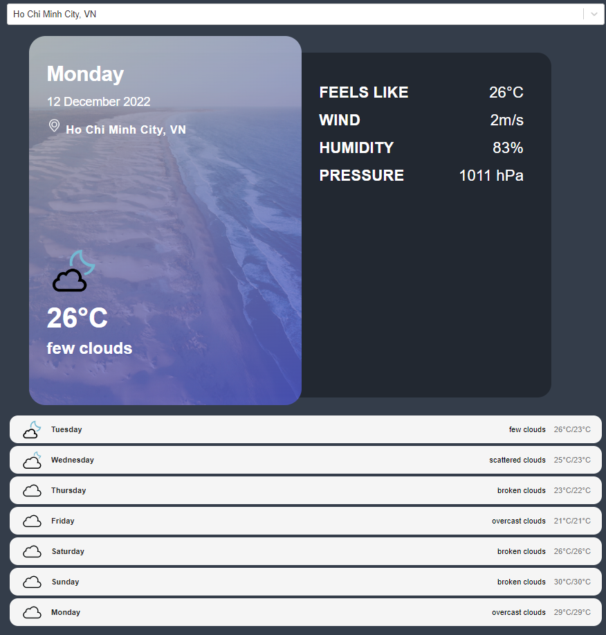

# REACT-WEATHER-APP
Check the weather around you and all over the world at a glance. Rely on the accurate weather forecast and adjust your schedule to the weather coming in. You won’t even have to look out the window as the app will make you feel like you are already outside!

## Introduction
This project was aimed to create a simple weather app for practicing JavaScript, fetching API and ReactJS. The app provides some information about current weather and give forecast in the next 5 days.

* Current and "Feels like" temparature.
* Wind speed.
* Humidity.
* Pressure.

## Technology
* ReactJS
* Vite
* Javascript
* HTML
* CSS
* Vercel

## Dependencies
This project uses API provided by third-party to get information about cities and its weather:
* React-select-async-paginate library.
* React-accesible-accorditon library.
* GeoDB API: https://rapidapi.com/wirefreethought/api/geodb-cities/
* OpenWeather API: https://openweathermap.org/api

## How to use
1. Type _npm i react-select-async-paginate_ into terminal.
2. Type _npm i react-accesible-accorditon_ into terminal.
3. Get your API keys at GeoDB and OpenWeather (both free).
3. Install Vite from: https://vitejs.dev/
4. Run development server using **npm start**.

## Live-Preview: https://weather-app-phongduong-dp.vercel.app/

